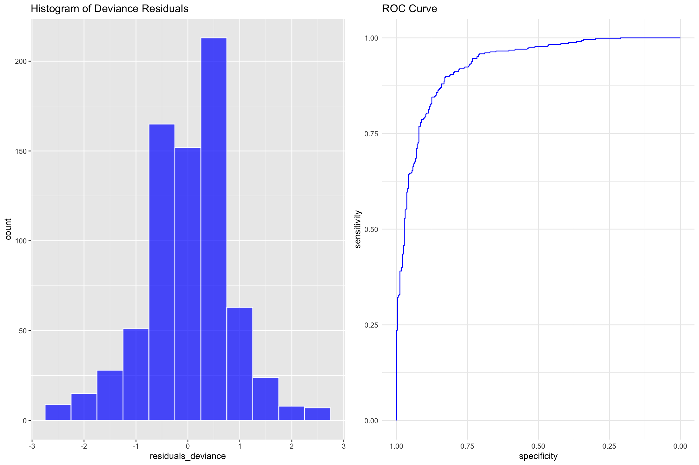
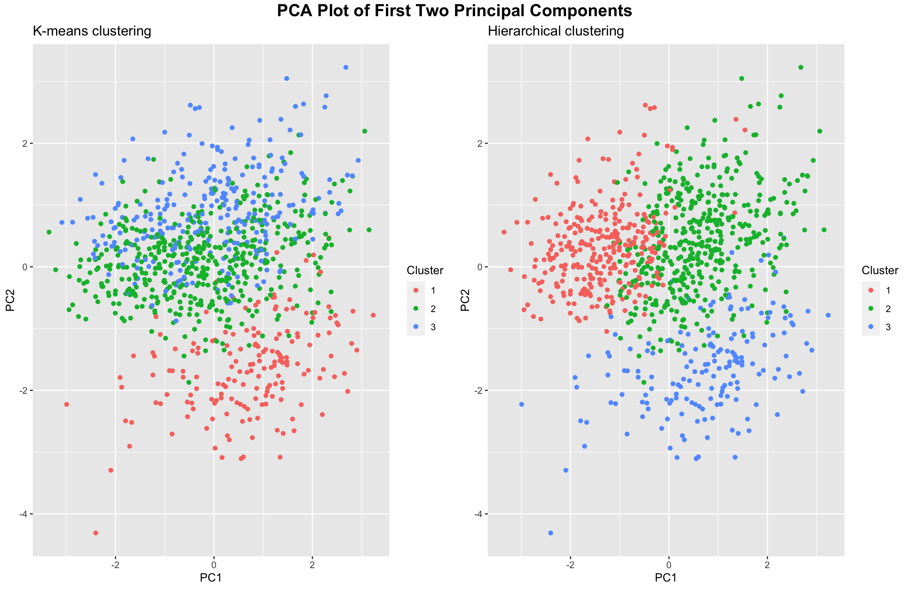

# Machine Learning-Based Risk Prediction & Patient Stratification in Heart Disease

## Overview
Cardiovascular disease remains one of the leading causes of mortality worldwide, yet risk prediction models often rely on aggregate patterns that may not reflect individual variation.

This project explores how machine learning can be used not only to predict heart disease risk, but also to better understand heterogeneity across patients. The goal was to build reliable predictive models while investigating whether different patient subgroups exhibit distinct risk patterns and model behavior.

Rather than focusing purely on performance, this work also examines interpretability, robustness, and the practical implications of model choice in a clinical context.

---

## Motivation
A recurring issue in predictive modelling is that models perform well "on average" while masking important variation across individuals.

This project was motivated by two key questions:
- Can we build accurate models for heart disease prediction using clinical data?
- Do different patient groups respond differently to these models, and what does that imply for real-world use?

---

 ## Summary
- Built ML models (AUC ≈ 0.95) for heart disease prediction  
- Identified patient heterogeneity via clustering  
- Found simpler models performed comparably to complex ones  
- Developed an interactive app for real-time prediction  

---

## Dataset
- Combined dataset of ~900 patient observations from multiple sources  
- Includes demographic, clinical, and diagnostic variables  
- Preprocessing included:
  - Handling missing values  
  - Feature scaling  
  - One-hot encoding for categorical variables  

---

## Methods

### Predictive Modelling
Several classification models were implemented and compared:
- Logistic Regression  
- Random Forest  
- Support Vector Machine (SVM)  
- K-Nearest Neighbors (KNN)  

Models were evaluated using:
- Cross-validation  
- ROC-AUC  
- Sensitivity & specificity  

---

### Dimensionality Reduction
- Principal Component Analysis (PCA) was used to reduce dimensionality and mitigate multicollinearity.

---

### Patient Stratification
To explore heterogeneity:
- Clustering techniques (k-means / hierarchical clustering) were applied  
- Patients were grouped based on feature similarity  
- Model performance was evaluated within each subgroup  

---

## Results

- All models achieved strong predictive performance (AUC ≈ 0.93–0.95)  
- Logistic Regression performed comparably to more complex models while offering greater interpretability  
- Clustering revealed distinct patient subgroups with different:
  - Risk profiles  
  - Model performance behavior  

---

### Model Visualizations & Perfomance

The predictive models achieved strong performance, with ROC-AUC values approaching 0.95.  
The ROC curve below illustrates the model’s ability to distinguish between classes across different thresholds.

This indicates that the model maintains high sensitivity while minimizing false positives, making it suitable for risk prediction tasks. Residual analysis suggests the model captures the overall structure of the data, although some variability remains.

This highlights the importance of:
- Understanding model limitations  
- Interpreting predictions cautiously in real-world settings

### Clustering & Patient Stratification

To explore heterogeneity in the dataset, clustering techniques were applied and visualized using PCA for dimensionality reduction.

Both k-means and hierarchical clustering reveal meaningful structure in the data, with partially overlapping but distinct patient subgroups.

This suggests that:
- Patients cannot be treated as a homogeneous population  
- Model performance and risk patterns may vary across clusters  

 --- 

## Key Insight

While all models achieved strong predictive performance, more complex models did not significantly outperform logistic regression.

This suggests that in high-stakes settings such as healthcare, the marginal gains from complex models may not justify the loss in interpretability.

Additionally, clustering revealed that model performance varies across patient subgroups, indicating that aggregate evaluation can obscure clinically meaningful heterogeneity. Overall, this project highlights that strong predictive performance alone is insufficient; understanding model behavior across heterogeneous populations is critical for reliable real-world application.

---

## Tools & Technologies
- Python / R  
- Scikit-learn / caret  
- Data preprocessing & visualization libraries  
- R Shiny (for interactive application)

---

## Interactive Application

An interactive web application was developed to:
- Allow real-time risk prediction  
- Visualize model outputs  
- Communicate results to both technical and non-technical users

[Launch App](https://hqapp2.shinyapps.io/Heartapp2/)

## Limitations

- Dataset size (~900 observations) may limit generalizability  
- Merged datasets introduce potential bias  
- Lack of longitudinal data restricts temporal insights

## Reproducibility
The repository includes the full R Markdown source used for the analysis, documenting preprocessing, modelling, and evaluation steps.

## Files
- 📄 Full thesis: [Thesis.pdf](./Thesis.pdf)
- 💻 Source code: [thesis.Rmd](./thesis.Rmd)
